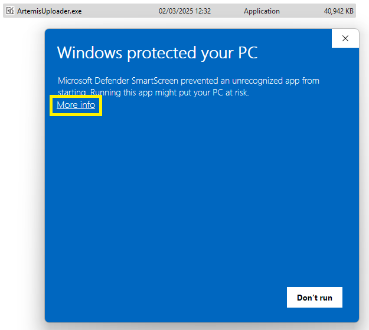
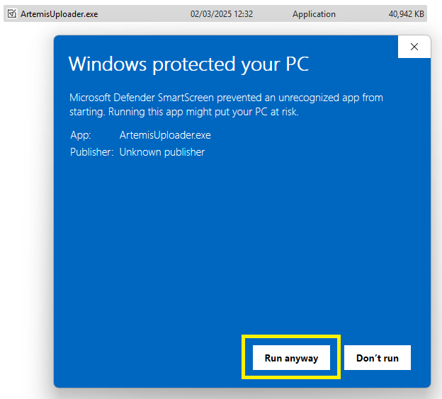

SparkFun Artemis Uploader App
========================================

<p align="center">
  <a href="https://github.com/sparkfun/Artemis-Firmware-Upload-GUI/issues" alt="Issues">
    </a>
  <a href="https://github.com/sparkfun/Artemis-Firmware-Upload-GUI/actions" alt="Actions">
    </a>
  <a href="https://github.com/sparkfun/Artemis-Firmware-Upload-GUI/blob/main/LICENSE.md" alt="License">
    </a>
  <a href="https://twitter.com/intent/follow?screen_name=sparkfun">
    </a>
</p>


The Artemis Uploader App is a simple, easy to use method for updating the firmware and bootloader on SparkFun Artemis based products. Available on all major platforms, as well as a Python package, the Artemis Uploader App simplifies working with SparkFun Artemis. 

If you need to install the application, see the [Installation Section](#installation) of this page.


# Using the Artemis Uploader
  
## Upload Firmware
  
* Click ```Browse``` and select the firmware file you'd like to upload (should end in *.bin*)
* Attach the Artemis target board over USB
* Select the COM port from the dropdown menu
* Adjust the Baud Rate as desired
* Click the  ```Upload Firmware``` Button in the lower right corner of the app.

The selected firmware is then uploaded to the connected SparkFun Artemis product. Upload information and progress are displayed in the output portion of the interface. 


## Update Bootloader

Clicking the ```Update Bootloader``` button on the lower left of the application will erase all firmware on the Artemis and load the latest bootloader firmware. This is helpful when SparkFun releases updates to the [SVL](https://github.com/sparkfun/SparkFun_Apollo3_AmbiqSuite_BSPs/blob/master/common/examples/artemis_svl/src/main.c).


**Note:** the bootloader update sometimes fails to start correctly. You may need to repeat the update more than once until it succeeds.

## Installation
Installation binaries are available for all major platforms (macOS, Window, and Linux) on the release page of the Artemis Uploader App github repository. 

[Artemis Uploader Release Page](https://github.com/sparkfun/Artemis-Firmware-Upload-GUI/releases)

### Windows
* Download the [github release](https://github.com/sparkfun/Artemis-Firmware-Upload-GUI/releases) zip file - *ArtemisUploader.win.zip*
* Unzip the release file - *ArtemisUploader.zip*
* This results in the application executable, *ArtemisUploader.exe*
* Double-click *ArtemisUploader.exe* to start the application


* The Windows EXE isn't signed, so you will see the following warning. Click **More info**:



* Click **Run anyway** to start the GUI:



### macOS

* Check that you have the latest WCH drivers installed for the CH340 interface chip.
    * Full instructions can be found in our [CH340 Tutorial](https://learn.sparkfun.com/tutorials/how-to-install-ch340-drivers/all#mac-osx)
    * Here is a link to the WCH downloads page for the [CH340 / CH341 macOS driver](https://www.wch-ic.com/downloads/CH341SER_MAC_ZIP.html)
    * The Zip file contains more instructions: CH34X_DRV_INSTAL_INSTRUCTIONS.pdf

* Download the [github release](https://github.com/sparkfun/Artemis-Firmware-Upload-GUI/releases) file - *ArtemisUploader.dmg*
* Click on the downloads icon
* Click the *ArtemisUploader.dmg* file to mount the disk image
* The following Finder window, with the contents of the file will open


* Install the *ArtemisUploader.app* by dragging it onto the *Applications* icon in the ArtemisUploader Finder Window, or copying the file to a desired location.
* Once complete, unmount the ArtemisUploader disk image by clicking on the disk eject in Finder.


To launch the Artemis Uploader application:

* Double-click ArtemisUploader.app to launch the application


* The ArtemisUploader.app isn't signed, so macOS won't run the application, and will display a warning dialog. Click **Done**.


* To approve app execution bring up the macOS *System Settings* and navigate to *Privacy & Security*. 
* On this page, select the **Open Anyway** button to launch the ArtemisUploader application.


* Once selected, macOS will present one last dialog. Select **Open Anyway** to run the application.


* Enter your password and click The ArtemisUploader will now start.


* Ensure you select the correct *COM Port*. The port name should begin with **cu.wchusbserial**.


* When you select the *Firmware File*, click **Allow** to allow the app to open the file.


### Linux

* Download the [github release](https://github.com/sparkfun/Artemis-Firmware-Upload-GUI/releases) file - *ArtemisUploader.linux.gz*
* Unzip the release file - *ArtemisUploader.linux.gz*
* Un-gzip the file, either by double-clicking in on the desktop, or using the `gunzip` command in a terminal window. This results in the file *ArtemisUploader* 
* To run the application, the file must have *execute* permission. This is performed by selecting *Properties* from the file right-click menu, and then selecting permissions. You can also change permissions using the `chmod` command in a terminal window.
* Once the application has execute permission, you can start the application a terminal window. Change directory's to the application location and issue `./ArtemisUploader`


### Python Package
The Artemis Uploader App is also provided as an installable Python package. This is advantageous for platforms that lack a pre-compiled application. 

To install the Python package:
* Download the [package file](https://github.com/sparkfun/Artemis-Firmware-Upload-GUI/releases) - *artemis_uploader-3.0.0.tar.gz* (note - the version number might vary)

At a command line - issue the package install command:

* `pip install artemis_uploader-3.0.0.tar.gz`
* Once installed, you can start the Artemis Uploader App by issuing the command `./artemis_upload` at the command line. (To see the command, you might need to start a new terminal, or issue a command like `rehash` depending on your platform/shell)

Notes:
* A path might be needed to specify the install file location.
* Depending on your platform, this command might need to be run as admin/root.
* Depending on your system, you might need to use the command `pip3`

The uploader is uninstalled by issuing this pip command: 
* `pip uninstall artemis-uploader`

### Raspberry Pi
We've tested the GUI on 64-bit Raspberry Pi Debian. You will need to use the **Python Package** to install it.

Notes:
* On 32-bit Raspberry Pi, with both Python 2 and Python 3 installed, use `sudo pip3 install artemis_uploader-3.0.0.tar.gz`
* On 64-bit Raspberry Pi, use `sudo pip install artemis_uploader-3.0.0.tar.gz`
* By default, the executable will be placed in `/usr/local/bin`
* The `sudo` is required to let `setup.py` install `python3-pyqt5` and `python3-pyqt5.qtserialport` using `sudo apt-get install`

### Example Firmware
In the applications github repo, an example *Blink.bin* firmware file is included in the repo. This firmware will cause these LEDs to blink at 1Hz:
* the D5 LED on the [SparkFun RedBoard Artemis ATP](https://www.sparkfun.com/products/15442)
* the D13 LED on the [SparkFun RedBoard Artemis](https://www.sparkfun.com/products/15444)
* the D18 LED on the [SparkFun Thing Plus - Artemis](https://www.sparkfun.com/products/15574)
* the D19 LED on the [SparkFun RedBoard Artemis Nano](https://www.sparkfun.com/products/15443)
* the Green LED on the [SparkFun Edge Development Board - Apollo3 Blue](https://www.sparkfun.com/products/15170)
* the STAT LED on the [OpenLog Artemis](https://www.sparkfun.com/products/15846)
* the D19 and GNSS LEDs on the [Artemis Global Tracker](https://www.sparkfun.com/products/16469)


